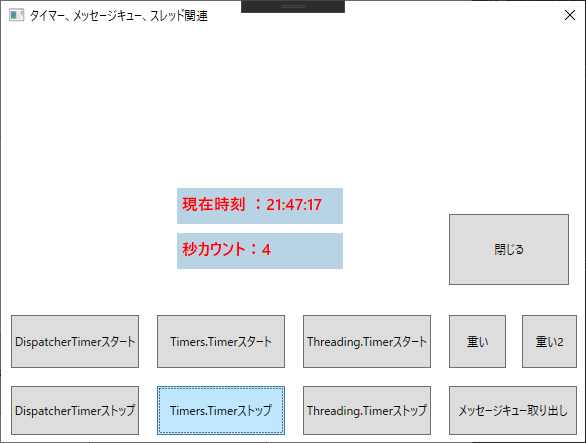

## :computer: WPFデスクトップアプリ/サンプル  

### 環境

```
開発環境：Microsoft Visual Studio 2019 Community Edition 16.7.2  
言語：C#.NET 8.0  
デスクトップ：WPFアプリケーション
デベロッパーSDK：.NET Core SDK 3.1.401  
データベース：Microsoft SQLServer 2019 Express CU6  
-データベース管理ツール：Microsoft SQL Server Management Studio 18.6  
データベース接続：.NET Framework Data Provider for SQL Server  
NuGetパッケージ：Install-Package System.Data.SqlClient -Version 4.8.2  
```

  